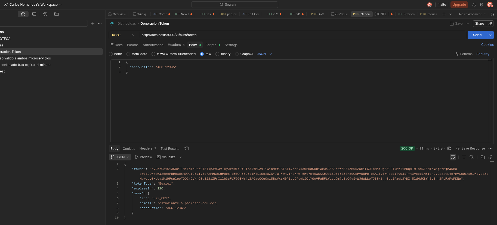
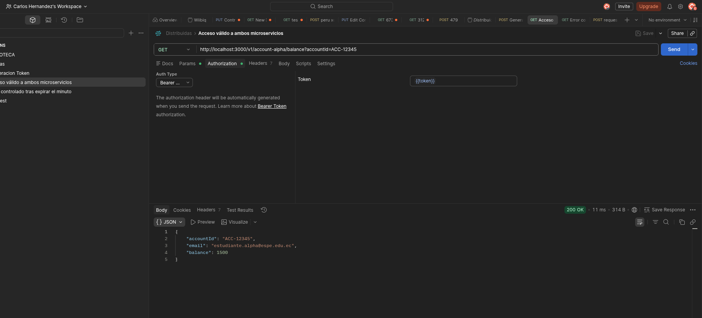
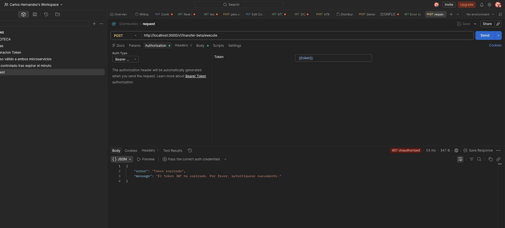
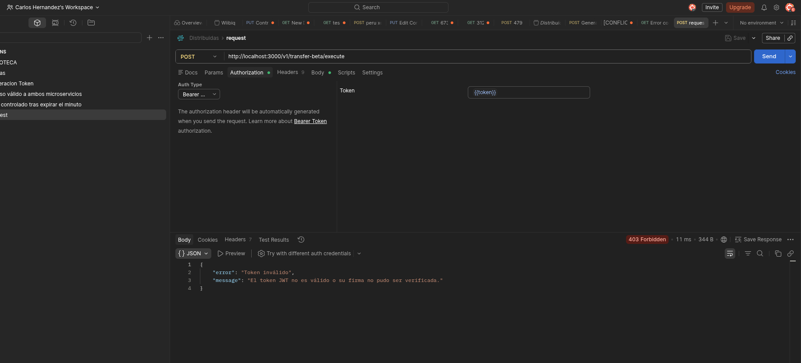
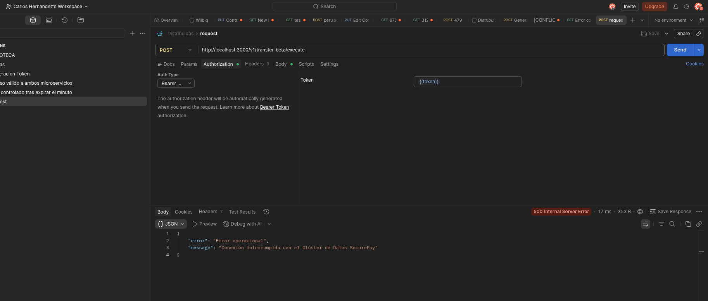
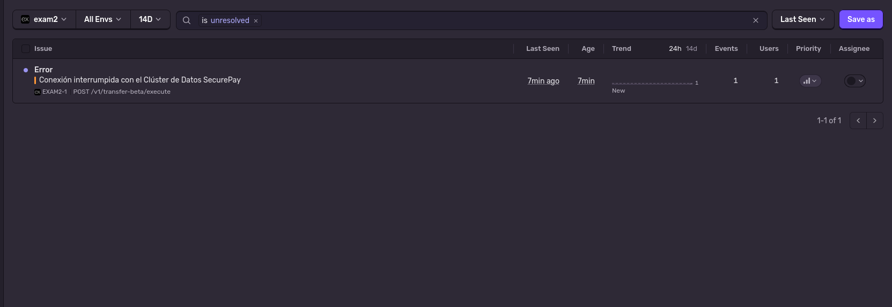
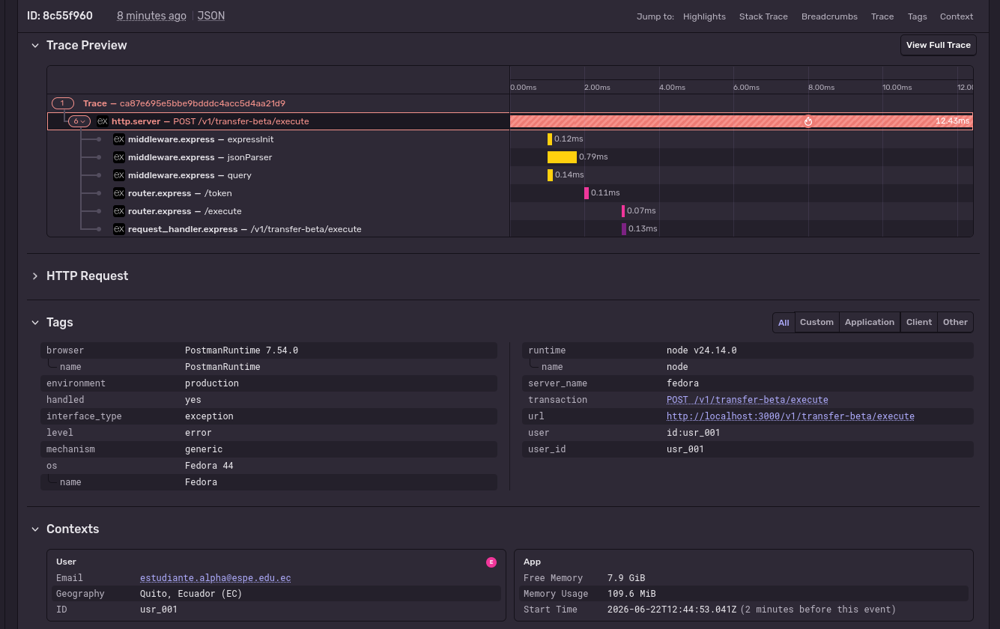

# Fintech SecurePay — Bitácora de Evaluación

**Asignatura:** Aplicaciones Distribuidas — ESPE  
**Autor:** Carlos Ha  
**Fecha:** Junio 2026

---

## 1. Arquitectura implementada

El proyecto parte de un servicio monolítico (`transaction.monolith.service.js`) que violaba el SRP. Se refactorizó aplicando los principios SOLID:

| Principio | Aplicación |
|-----------|-----------|
| **SRP** | Cada responsabilidad aislada en su propio servicio de bajo nivel |
| **DIP** | `TransactionService` recibe sus dependencias vía constructor desde `container.js` |

### Servicios resultantes

```
src/
├── container.js                          ← Composition root (ensambla dependencias)
├── instrument.js                         ← Inicialización de Sentry
└── services/
    ├── account.repository.service.js     ← Estado en memoria de cuentas
    ├── transaction.repository.service.js ← Historial + generación de IDs
    ├── financial.validation.service.js   ← Reglas de negocio financiero
    ├── notification.service.js           ← Notificaciones simuladas por consola
    ├── transaction.service.js            ← Orquestador con DIP
    └── jwt.service.js                    ← Firma y verificación RS256
```

---

## 2. Seguridad — JWT RS256

- **Algoritmo:** RS256 (firma asimétrica con par de claves PEM)
- **Claims del payload:** `sub` (ID de usuario), `name` (email), `exp` (2 minutos)
- **Verificación:** el middleware usa únicamente `public.pem`, sin acceso a la clave privada
- **Protección anti-downgrade:** se fuerza `algorithms: ['RS256']` en `jwt.verify`

---

## 3. Endpoints disponibles

| Método | Ruta | Auth | Descripción |
|--------|------|------|-------------|
| `POST` | `/v1/auth/token` | No | Genera JWT para una cuenta |
| `GET`  | `/v1/account-alpha/balance` | Bearer | Consulta saldo |
| `POST` | `/v1/transfer-beta/execute` | Bearer | Ejecuta transferencia (dispara error 500) |

---

## 4. Evidencia — Postman

### 4.1 Generación del token

<!-- Captura: POST /v1/auth/token → respuesta 200 con el campo token -->



---

### 4.2 Acceso válido — Consulta de saldo

<!-- Captura: GET /v1/account-alpha/balance con Bearer token válido → 200 OK -->



---

### 4.3 Token expirado — Error lógico (no reportado a Sentry)

<!-- Captura: request con token vencido → 401 Token expirado -->



---

### 4.4 Token malformado — Error lógico (no reportado a Sentry)

<!-- Captura: request con token inválido → 403 Token inválido -->



---

### 4.5 Error operacional — Fallo de conexión al clúster (reportado a Sentry)

<!-- Captura: POST /v1/transfer-beta/execute con token válido → 500 -->



---

## 5. Evidencia — Sentry

### 5.1 Evento capturado en el dashboard

<!-- Captura: panel Issues de Sentry mostrando el error "Conexión interrumpida con el Clúster de Datos SecurePay" -->



---

### 5.2 Tags de usuario adjuntos al evento

<!-- Captura: detalle del evento en Sentry mostrando Tags con user_id y sección User con id y email -->



---

## 6. Reglas de observabilidad distribuida aplicadas

| Escenario | HTTP | Reporta a Sentry | Justificación |
|-----------|------|-------------------|---------------|
| Token expirado | 401 | No | Error lógico controlado — el cliente debe renovar su token |
| Token malformado | 403 | No | Error lógico controlado — firma inválida, no es un fallo de infraestructura |
| Fallo de conexión al clúster | 500 | **Sí** | Error operacional — requiere atención del equipo de infraestructura |
